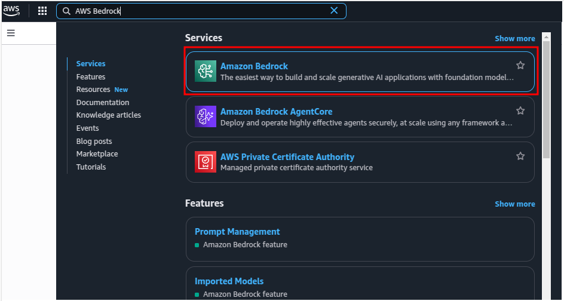
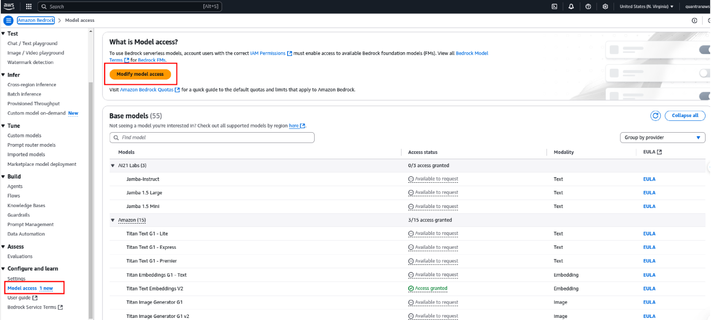
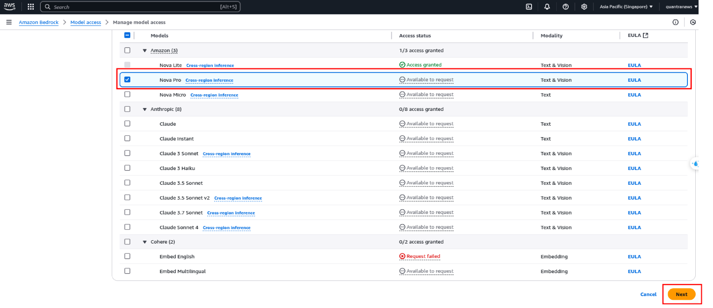
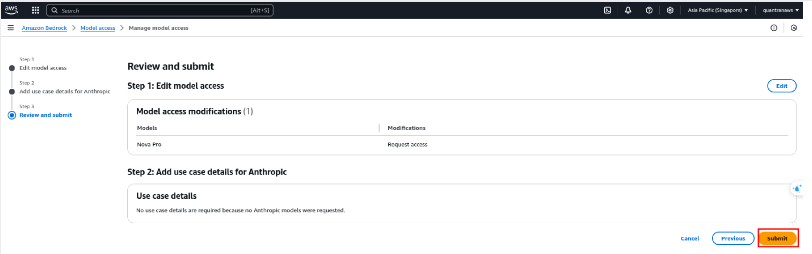
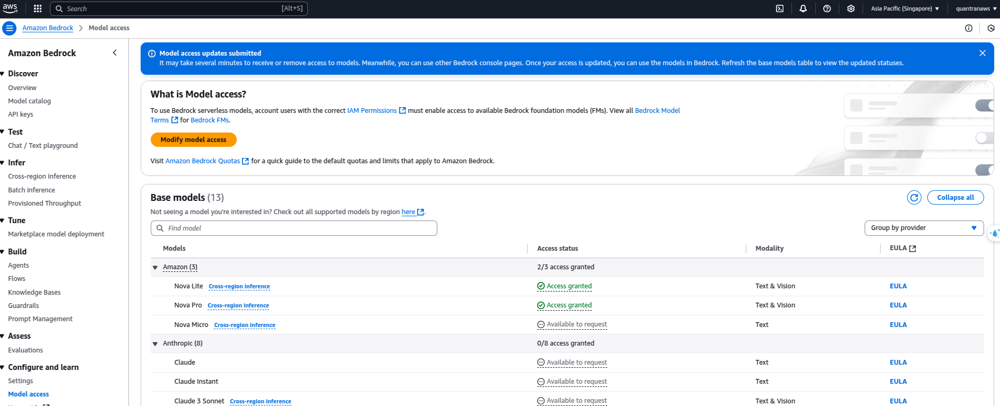

# BonBon Assignment - LangChain

## Overview
This project demonstrates how to build a chatbot solution for customer support scenarios using LangChain. The chatbot is capable of answering frequently asked questions (FAQs) from the provided `BonBon FAQ.pdf` file and supports conversational interactions with users.

The chatbot leverages:
- **LangChain** for building conversational agents.
- **AWS Bedrock** for embeddings and reasoning.
- **Chroma** for vector database storage.
- **DuckDuckGo** for internet search capabilities.

## Features
1. **Document Indexing**:
   - Indexes the content of `BonBon FAQ.pdf` into a local Chroma vector database.
   - Uses embedding models like `amazon.titan-embed-text-v2:0` for vector creation.

2. **Chatbot**:
   - Supports context-aware conversations.
   - Answers FAQs using the private knowledge base.
   - Uses AWS Bedrock for reasoning.
   - Equipped with tools for:
     - Knowledge Base Search.
     - Internet Search.


## Setup Instructions

### Pre-requisites
- **WSL** (Windows Subsystem for Linux)
- **Miniconda3**

### Environment Setup
1. Create a Conda environment:
   ```bash
   conda create -n langchain python=3.11
   ```
2. Activate the environment:
   ```bash
   conda activate langchain-training
   ```
3. Install required packages:
   ```bash
   pip install langchain langchain-aws boto3 chromadb pypdf python-dotenv langchain-community
   ```
4. Creating an IAM User and Generating Credentials in the AWS Console
5. Set environment variables in a `.env` file:
   ```plaintext
   AWS_ACCESS_KEY_ID=<your-access-key>
   AWS_SECRET_ACCESS_KEY=<your-secret-key>
   AWS_REGION=<your-region>
   AWS_MODEL_EMBEDDINGS=<your-model-embeddings>
   AWS_MODEL_CHAT='your-model'
   ```

### AWS Bedrock Setup
You can reference the AWS documentation: https://docs.aws.amazon.com/bedrock/latest/userguide/model-access-modify.html

1. Navigate AWS Bedrock.


2. Choose the Model Access page, choose Modify model access to request model you want to use.


3. Select the model you want to request and click 'Next'. The AWS limits the number of models in each region.

4. You can review and submit to request model.

5. If your request is successful, the Access status changes to Access granted.


### Running the Project
1. Ensure the `BonBon FAQ.pdf` file is located in the `data/` directory.
2. Follow the interactive chatbot instructions.

## Assignments

### Assignment 1: Document Indexing
- Index the content of `BonBon FAQ.pdf` into a local Chroma vector database.
- Use embedding models like `amazon.titan-embed-text-v2:0`.

### Assignment 2: Building Chatbot
- Build a chatbot using LangChain's Conversational ReAct agent.
- Equip the chatbot with tools for knowledge base and internet search.
- Ensure the chatbot provides answers with source file and page references.


